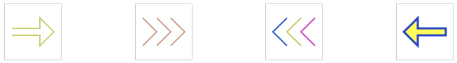

# canvas
canvas study

## first

## 一些小知识
0. canvas是基于状态的绘制。 
1. 状态设置： moveTo\lineTo\lineWidth\strokeStyle\fillStyle\... 
2. 绘制： fill\stroke 
3. moveTo起点的坐标，lineTo绘制的坐标 
4. 如果要给下一段设置不同的样式，可以用beginPath()表示开始一段全新的状态。 
5. beginPath()配合closePath() 可以无缺口完美封闭绘制的多边形。 
6. 填充色：fillStyle，之后要执行fill()才能生效，如果要给边框加颜色也要在fill()方法之后添加，否则边框的宽度会变小。 
7. rect可以自动完成矩形绘制，fillRect&strokeRect分别设置自动完成矩形样式、绘制。 

### 日常填坑记录
1. 创建canvas元素要使用canvas标签，用div浏览器会报错，没有getContext方法。 
